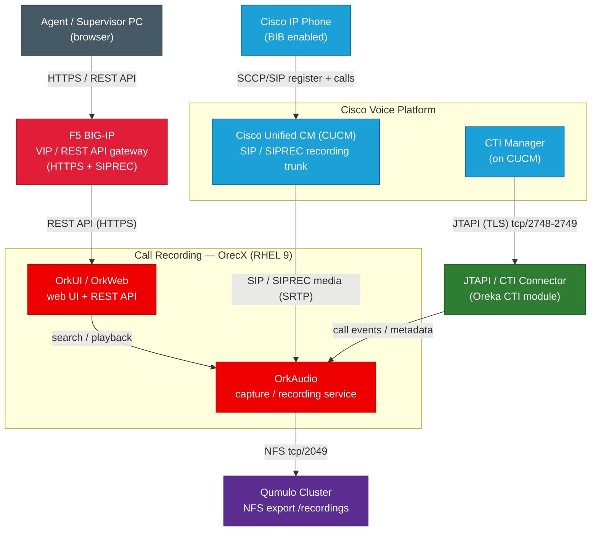

# Call Recording Architecture — OrecX component detail

Component-level view of the OrecX call recording stack, showing the REST API
path (PC → F5 → OrkUI), the media path (CUCM SIP/SIPREC → OrkAudio), and the
JTAPI / CTI connector in the middle (CUCM CTI Manager → CTI connector → OrkAudio).

> Open `call-recording-architecture.drawio` at [app.diagrams.net](https://app.diagrams.net)
> (Visio substitute; exports `.vsdx`). The Mermaid below renders on GitHub.

## Connector / flow table

| From | To | Label |
|---|---|---|
| Cisco IP Phone | CUCM | SCCP/SIP register + calls |
| PC | F5 | HTTPS / REST API |
| F5 | OrkUI/OrkWeb | REST API (HTTPS) |
| CUCM | OrkAudio | SIP / SIPREC media (SRTP) |
| CUCM (CTI Manager) | JTAPI/CTI Connector | JTAPI (TLS) 2748-2749 |
| JTAPI/CTI Connector | OrkAudio | call events / metadata |
| OrkUI/OrkWeb | OrkAudio | search / playback |
| OrkAudio | Qumulo | NFS tcp/2049 |

## OrecX (Oreka) components

- **OrkAudio** — capture daemon; receives SIP/SIPREC + RTP, writes audio files.
- **OrkUI / OrkWeb** — web front end and REST API for search and playback.
- **JTAPI / CTI Connector** — talks to CUCM CTI Manager via JTAPI to attach call
  metadata (agent, ANI/DNIS, call ID) to recordings.
