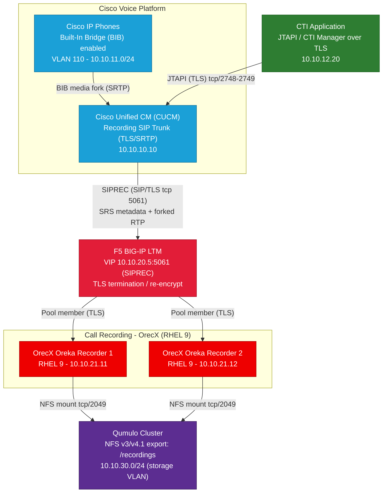

# Call Recording Architecture

CUCM Built-In Bridge (BIB) / SIPREC → F5 BIG-IP → OrecX recorders (RHEL 9) → Qumulo NFS,
with a CTI application interfacing CUCM via JTAPI over TLS.

> Visio alternative: open `call-recording-architecture.drawio` in
> [draw.io / diagrams.net](https://app.diagrams.net) (free, browser or desktop;
> imports/exports Visio `.vsdx`). The Mermaid version below renders natively on
> GitHub and lives in the repo as code.

## Asset inventory

| Asset | Role | Protocol / Port | Example IP |
|---|---|---|---|
| Cisco IP Phones (BIB) | Built-In Bridge forks call media for SIPREC | SRTP | 10.10.11.0/24 |
| Cisco Unified CM | Call control + SIPREC recording trunk (SRC) | SIP/TLS 5061, SRTP | 10.10.10.10 |
| CTI Application | Call events / control via CTI Manager | JTAPI over TLS tcp/2748-2749 | 10.10.12.20 |
| F5 BIG-IP LTM | Load balances SIPREC to recorder pool, TLS termination/re-encrypt | SIP/TLS 5061 VIP | 10.10.20.5 |
| OrecX Oreka (×2) | SIPREC Session Recording Server (SRS) on RHEL 9 | SIP/TLS, RTP | 10.10.21.11–.12 |
| Qumulo cluster | NFS storage for recordings (`/recordings` export) | NFS tcp/2049 | 10.10.30.0/24 |

*IP addresses are placeholders — replace with your real addressing.*
